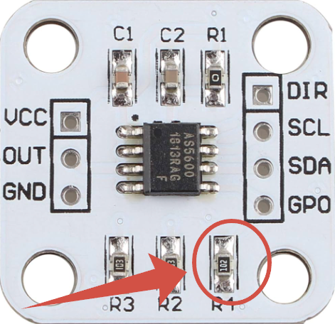

# Wire Tension Controller (Arduino Nano)

Данный проект представляет собой систему автоматического контроля натяжения проволоки на базе микроконтроллера **Arduino Nano**. Устройство управляет двумя шаговыми двигателями: скорость первого динамически подстраивается через PID-регулятор для поддержания натяжения, а скорость второго задается вручную пользователем.

---

## ⚙️ Основные функции
* **Автоматическое поддержание натяжения:** Отслеживание положения рычага с помощью магнитного энкодера AS5600 и корректировка скорости ШД через PID-алгоритм.
* **Ручное управление вторым ШД:** Регулировка скорости потенциометром и смена направления вращения с помощью кнопки.
* **Безопасность и мониторинг:** 
  * Определение обрыва проволоки или выхода рычага за рабочие пределы с автоматической остановкой моторов и звуковым оповещением.
  * Контроль проскальзывания проволоки при сильном расхождении скоростей двигателей.
---

## 🔌 Схема подключения (Пинкаут)

### 1. Шаговые двигатели & Драйверы (TMC2209)

| Назначение | Пин Arduino | Описание |
|---|---|---|
| **STEP 1** | `D3` | Пин Step драйвера 1-го ШД |
| **DIR 1** | `D2` | Пин Dir драйвера 1-го ШД  |
| **ENABLE 1** | `D6` | Пин Enable драйвера 1-го ШД |
| **STEP 2** | `D5` | Пин Step драйвера 2-го ШД |
| **DIR 2** | `D4` | Пин Dir драйвера 2-го ШД  |
| **ENABLE 2** | `D7` | Пин Enable драйвера 2-го ШД  |

### 2. Датчики и Органы управления

| Компонент | Пин Arduino | Описание |
|---|---|---|
| **AS5600 (Out)** | `A0` | Аналоговый выход датчика положения рычага  |
| **Потенциометр** | `A1` | Регулятор скорости 2-го ШД (шаги/сек)  |
| **Кнопка направления** | `D12` | Переключатель направления 2-го ШД. При нажатии — подает `5V`, при отпускании — подтянут к `GND` через резистор **10 кОм**  |

### 3. Индикация и Оповещение

| Компонент | Пин Arduino | Описание |
|---|---|---|
| **Сигнальный LED** | `D8` | Светодиод аварии/проскальзывания (подключать через резистор **220 Ом**)  |
| **Пищалка (Buzzer)** | `D9` | Выход на специализированный драйвер **UCC27517DBVR** (для обеспечения достаточного тока и громкого звука пищалки. Напрямую от пина Arduino питать пищалку нельзя). |

---

## 🛠 Настройка датчика AS5600

### 1. Перевод модуля AS5600 в аналоговый режим
По умолчанию большинство плат датчика AS5600 настроены на работу по шине I2C или выдают ШИМ (PWM). Чтобы перевести датчик в **режим вывода аналогового напряжения (Analog Out)** на пине **"`OUT`"**:
* На стандартных китайских платах AS5600 необходимо **отпаять резистор R4**, подтягивающий пин выбора режима. Это переводит выходной каскад микросхемы в режим `Analog Ratiometric`, выдающий от 0 до 5V пропорционально углу поворота.



### 2. Калибровка магнита и рычага
Для корректной работы PID-регулятора в начальном положении рычага значение `analogRead(A0)` должно находиться строго в диапазоне **от 0 до 15**. 

Используйте этот короткий тестовый скетч для точной юстировки магнита:

```cpp
void setup() {
  Serial.begin(9600);
  pinMode(A0, INPUT);
}

void loop() {
  int rawValue = analogRead(A0);
  Serial.print("Положение магнита (Analog A0): ");
  Serial.println(rawValue);
  delay(200); // Задержка для читаемости в мониторе порта
}
```

**Инструкция по настройке:**
1. Залейте тестовый скетч в Arduino Nano.
2. Переведите рычаг устройства в **исходное (начальное) положение**.
3. Вращайте и смещайте постоянный магнит на оси рычага относительно микросхемы AS5600, пока в Мониторе порта значения `analogRead` не стабилизируются в диапазоне **0...15**.
4. Надежно зафиксируйте магнит в этом положении.
 #### ⚠️Обратите внимание, что при наклоне рычага в рабочем направлении, значение должно увеличиваться, а не уменьшаться. Если это не так, то пин DIR на модуле AS5600 необходимо замкнуть либо на GND, либо на VCC.
---

## 🔍 Алгоритм обнаружения проскальзывания

Система безопасности непрерывно контролирует разницу скоростей между двумя двигателями во избежание проскальзывания проволоки:
1. Скорость 2-го двигателя (`spd2`) задается жестко потенциометром.
2. Скорость 1-го двигателя (`spd1`) динамически рассчитывается PID-регулятором.
3. Каждые 40 итераций основного цикла происходит сверка скоростей (проверка завязана на программный счетчик `i` из-за перегрузки таймера прерываниями, управляющими ШД).
4. Если модуль разницы скоростей превышает **200 шагов/сек** (`abs(spd2 - abs(spd1)) > 200`), устройство считает, что проволока проскальзывает, и генерирует короткий звуковой/световой сигнал.

---

## 🚀 Инструкция по эксплуатации

### Старт работы и сброс аварии
1. При включении устройства рычаг находится в начальном положении (`analogRead(A0) < 15`).
2. Система сразу переходит в режим аварии: моторы отключены, а пищалка издает двухтональный протяженный сигнал тревоги.
3. **Для запуска работы:** необходимо **вручную наклонить рычаг** натяжителя так, чтобы датчик попал в рабочую зону (значение `analogRead(A0)` станет больше 15).
4. Как только рычаг зафиксирован в рабочей зоне, двигатели автоматически активируются, и PID-регулятор начинает удерживать заданное натяжение.

---

## 📁 Структура проекта

Проект логически разделен на модули (вкладки в Arduino IDE) для удобства чтения:
* **`Wire_Tension.ino`** — главный файл. Инициализирует периферию, содержит основной цикл `loop()` с логикой аварии, расчетом PID и маппингом потенциометра.
* **`alarm.ino`** — функции оповещения: `alarm()` для обработки обрыва/старта и `alarm_slippage()` для индикации проскальзывания.
* **`pid.ino`** — инициализация и конфигурирование базовых параметров PID-регулятора (`Kp`, `Ki`, `Kd`, направление регулирования и лимиты скоростей).
* **`timers.ino`** — обработчик прерывания таймера `timerISR()` для пошаговой генерации импульсов ШД, а также функции установки скоростей `setSpeed1()` и `setSpeed2()` с прямым управлением регистрами портов (`PORTD`) для максимального быстродействия.

## 📚 Зависимости
Для компиляции скетча требуются библиотеки:
* **TimerOne** (генерация точных интервалов шагов в прерывании)
* **GyverPID** (библиотека PID-регулятора от AlexGyver)
