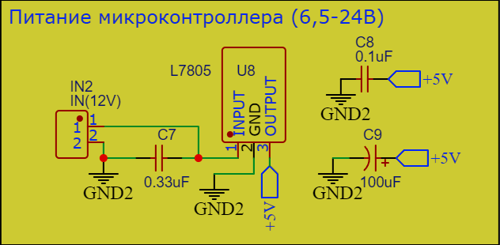
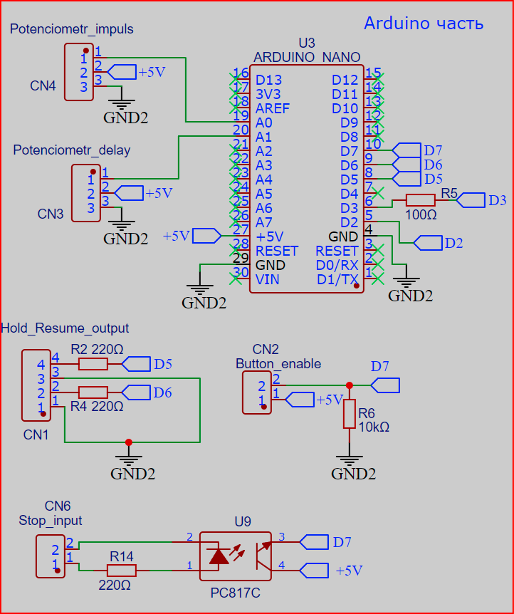
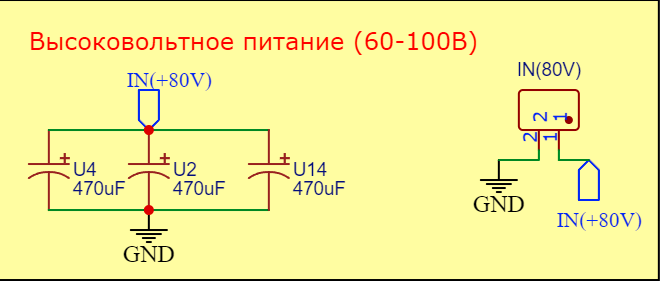
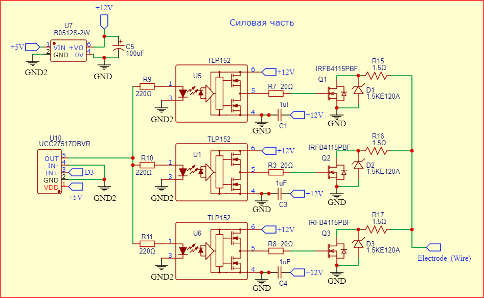
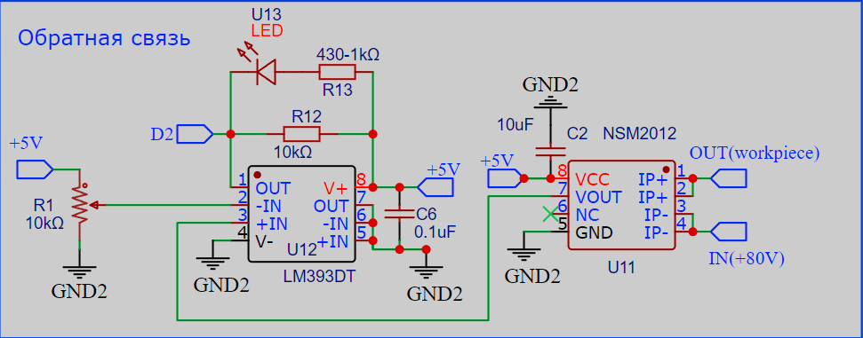

# ⚡ Генератор импульсов для электроэрозионного станка (Pulse Generator)

<table>
  <tr>
    <td align="center"><b>Схема генератора импульсов</b></td>
    <td align="center"><b>Готовая плата генератора</b></td>
  </tr>
  <tr>
    <td></td>
    <td></td>
  </tr>
</table>

> [!WARNING]
> ⚠️ **ВНИМАНИЕ! ВЫСОКОЕ НАПРЯЖЕНИЕ!** Для работы генератора импульсов используется опасное для жизни напряжение **80 В**.
> * Будьте предельно осторожны при сборке, отладке и эксплуатации устройства. Особенно с учётом наличия рядом ёмкости с водой.
> * Автор проекта не несёт ответственности за любой ущерб здоровью или имуществу, полученный в ходе повторения данной конструкции. Все действия вы производите на свой собственный страх и риск.

---

## 📖 Описание

Электронная схема генератора импульсов для электроэрозионного станка на базе **Arduino Nano**.

Устройство генерирует прямоугольные импульсы с настраиваемой длительностью и частотой, а также определяет факт возникновения искры (электрического разряда) во время импульса.

* **Логика работы** более подробно описана в папке с [прошивкой](../../Firmware/EDM_NEW)

---

## ⚙️ Состав устройства

Схема состоит из **5-ти основных блоков**:

### 1. Питание микроконтроллера (12–24 В)

- **Разъём питания** для подачи входного напряжения.
- **Стабилизатор L7805** понижает входное напряжение до **5 В**.
  - Керамический конденсатор **0,33 мкФ** на входе и **0,1 мкФ** на выходе — требование даташита.
  - Электролитический конденсатор **100 мкФ** — для дополнительной стабилизации.

### 2. Блок Arduino Nano

- **Разъём (U3)** для установки платы Arduino Nano.
- **Разъёмы** для подключения потенциометров, регулирующих длительность импульсов (CN4) и частоту (CN3).
- **Разъём (CN1)** для подключения внешних оптопар, управляющих пинами **HOLD/RESUME** на плате управления станком.
- **Разъём (CN2)** для подключения кнопки (подаёт 5 В на пин **D7**).
- **Разъём (CN6)** для управления оптопарой. Эта оптопара дублирует кнопку выше, то есть также подаёт 5 В на пин **D7**. Оптопара активируется модулем натяжения проволоки в случае обрыва проволоки, таким образом станок переходит в режим паузы.

### 3. Высоковольтное питание

- **Разъём** для подключения напряжения от **60 до 100 В**.
- **Блок конденсаторов** с низким ESR (470 мкФ).

### 4. Силовая часть

- **Элемент B0512S-2W** — модуль гальванической развязки повышает **5 В до 12 В**, необходимых для управления затворами мосфетов.
  - На выходе электролитический конденсатор на **100 мкФ** для стабилизации питания.
- **Сигнал** от пина **D3** Arduino поступает на драйвер **UCC27517DBVR**. Драйвер через резисторы **220 Ом** управляет тремя оптодрайверами **TLP152**. Каждый оптодрайвер через резистор **20 Ом** управляет соответствующим мосфетом **IRFB4115PBF**. Питание **12 В** для управления затворами поступает от модуля гальванической развязки **B0512S-2W**.
  - Параллельно и как можно ближе к контактам питания элементов **TLP152** стоят керамические конденсаторы на **1 мкФ**.
- **На выходе каждого мосфета** стоит нагрузочный резистор **1,5 Ом** мощностью **100 Вт** (тип **AH-100**). Он нужен для защиты мосфета в случаях короткого замыкания.
  - **Важно:** эти резисторы выносятся за пределы печатной платы и монтируются на радиаторы, так как выделяют значительное количество тепла.
- **Параллельно каждому мосфету** стоит защитный диод **1.5KE120A**. Их задача — защищать мосфеты от индукционных выбросов.
- **На выходе** резисторы соединяются вместе, и ток дальше подаётся через токосъёмники на проволоку.
- **Мосфеты** крайне желательно снабдить радиаторами. Также и резисторы желательно прикрутить к радиаторам либо организовать активное охлаждение.

### 5. Обратная связь

- **Плюсовая линия питания 80 В** проходит через датчик тока **NSM2012**
  > (датчик тока размещён после конденсаторов, он должен мгновенно реагировать на каждый импульс).
- **Сигнальный выход** этого датчика поступает на вход компаратора **LM393DT**.
- **Порог срабатывания** компаратора устанавливается вручную с помощью подстроечного резистора.
- **Момент срабатывания** можно увидеть благодаря светодиоду.

**Настройка порога срабатывания компаратора:**

1. Выставить минимальную длительность импульсов и частоту.
2. Замкнуть проволоку и заготовку, чтобы было короткое замыкание.
3. Запустить генерацию импульсов (генератор спокойно выдержит короткое замыкание).
4. Подкрутить подстроечный резистор, пока не загорится светодиод.
5. Отвести проволоку от заготовки, чтобы разомкнуть цепь, и убедиться, что светодиод погас.
6. Желательно перепроверить несколько раз, что компаратор правильно срабатывает на замыкание/размыкание цепи.

---

## 📝 Примечания

> Потенциометр, регулирующий частоту импульсов, на самом деле регулирует длительность паузы между импульсами. Это косвенно связано с частотой, но при повороте потенциометра по часовой стрелке длительность паузы будет увеличиваться, а частота соответственно уменьшаться. Это не совсем привычно. Если это сбивает с толку, то на потенциометре можно просто поменять местами пины питания. Тогда при повороте потенциометра вправо будет увеличиваться частота импульсов (а длительность паузы соответственно уменьшаться).

> **О проводах:** Провода, идущие к заготовке и проволоке, должны быть потолще и скручены в спираль для снижения их индуктивности и защиты окружающей электроники от электромагнитных помех.

---

## 📋 Список компонентов

| № | Компонент | Номинал / Модель | Кол-во | Примечание |
|---|-----------|------------------|:------:|------------|
| 1 | Стабилизатор напряжения | L7805 | 1 | Понижает входное напряжение до 5 В |
| 2 | Плата Arduino | Arduino Nano | 1 | Микроконтроллер |
| 3 | Модуль гальванической развязки | B0512S-2W | 1 | 5 В → 12 В |
| 4 | Драйвер MOSFET | UCC27517DBVR | 1 | Управление оптодрайверами |
| 5 | Оптодрайвер | TLP152 | 3 | Управление мосфетами |
| 6 | Оптопара | PC817C | 1 | Гальваническая развязка сигнала D7 |
| 7 | MOSFET | IRFB4115PBF | 3 | Силовые ключи |
| 8 | Датчик тока | NSM2012 | 1 | Измерение тока |
| 9 | Компаратор | LM393DT | 1 | Сравнение сигнала |
| 10 | Светодиод | LED (красный) | 1 | Индикация срабатывания |
| 11 | Диод защитный | 1.5KE120A | 3 | Защита от индукционных выбросов |
| 12 | Конденсатор керамический | 0,33 мкФ | 1 | Обвязка L7805 |
| 13 | Конденсатор керамический | 0,1 мкФ | 2 | Обвязка L7805 и LM393DT |
| 14 | Конденсатор керамический | 1 мкФ | 3 | Питание TLP152 |
| 15 | Конденсатор керамический | 10 мкФ | 1 | Питание NSM2012 |
| 16 | Конденсатор электролитический | 100 мкФ | 2 | Стабилизация питания L7805 и B0512S-2W |
| 17 | Конденсатор электролитический  (Low ESR) | 470 мкФ | 3 | Блок конденсаторов высоковольтного питания |
| 18 | Резистор | 100 Ом | 1 | Между D3 и UCC27517DBVR |
| 19 | Резистор | 220 Ом | 6 | Цепи управления оптодрайверами и оптопарой |
| 20 | Резистор | 20 Ом | 3 | Между TLP152 и мосфетами |
| 21 | Резистор | 10 кОм | 2 | Подтяжка к GND выхода компаратора и пина D7 Arduino |
| 22 | Резистор | 430 Ом – 1 кОм | 1 | Токоограничивающий для светодиода |
| 23 | Резистор нагрузочный (выносной) | 1,5 Ом, 100 Вт, тип AH-100 | 3 | Защита мосфетов при КЗ |
| 24 | Резистор подстроечный | 10 кОм | 1 | Настройка порога компаратора |
| 25 | Разъём | IN(12V), KF301-5.0-2P | 1 | Вход питания микроконтроллера |
| 26 | Разъём | IN(80V), KF301-5.0-2P | 1 | Вход высоковольтного питания |
| 27 | Разъём | ZX-XH2.54-3PZZ | 2 | Подключение потенциометров |
| 28 | Разъём | ZX-XH2.54-4PZZ | 1 | Выход HOLD/RESUME |
| 29 | Разъём | XH2.54-2PIN | 1 | Кнопка |
| 30 | Разъём | SH-XH2.54-2PWZ | 1 | Вход сигнала остановки |

---

## 📁 Как открыть файлы в EasyEDA

1. Откройте онлайн-редактор [EasyEDA](https://easyeda.com/editor) или запустите десктопное приложение.
2. В верхнем левом меню выберите: **Файл (File)** ➡️ **Открыть (Open)** ➡️ **EasyEDA...**
3. Загрузите интересующий вас `.json` файл.

---
