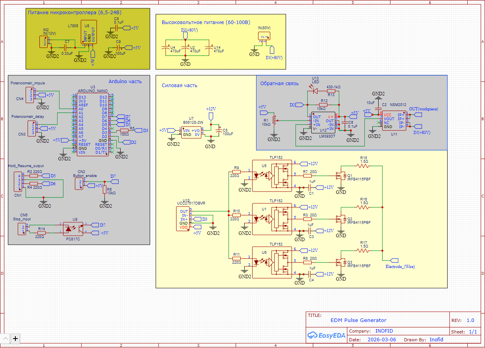
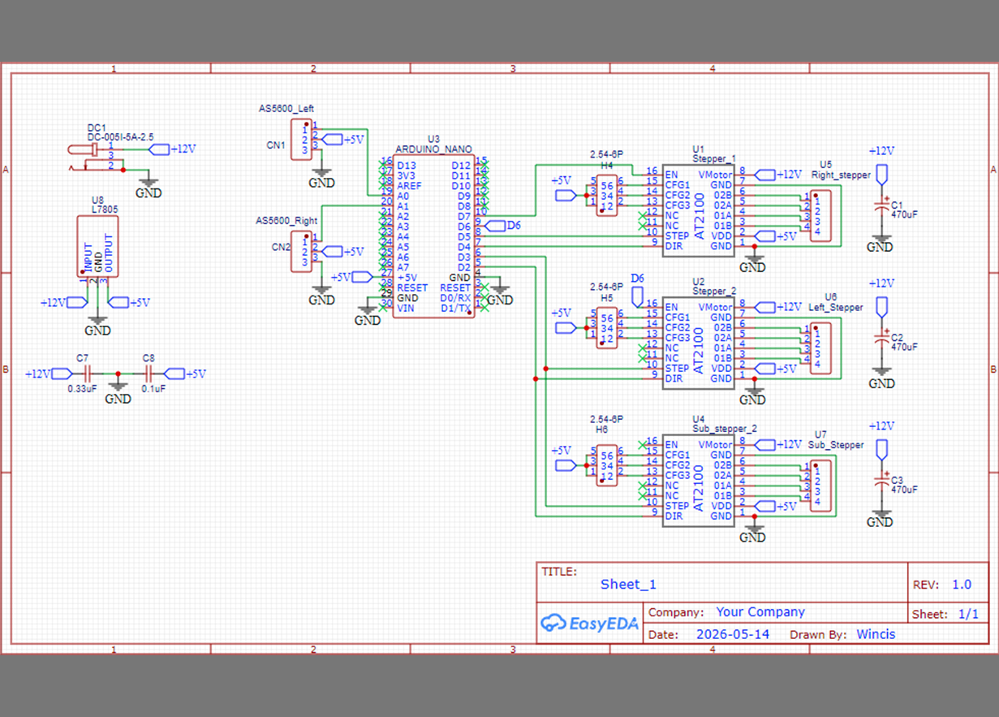
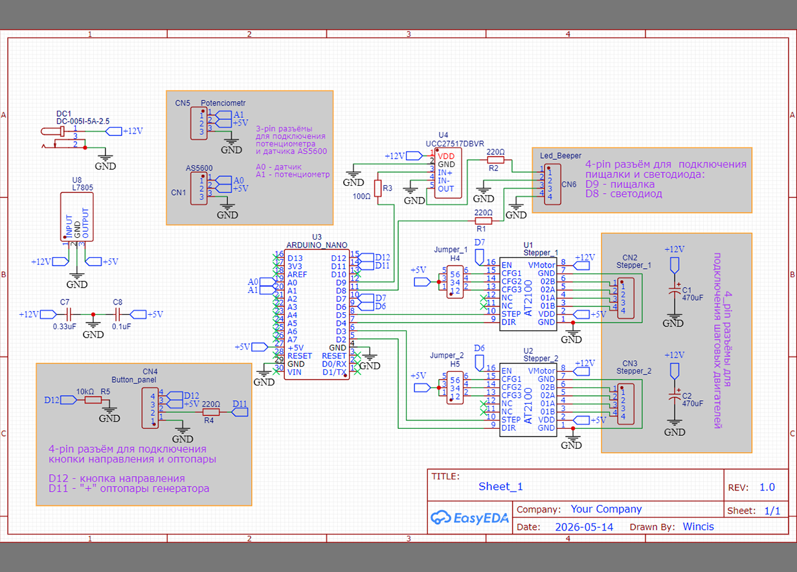
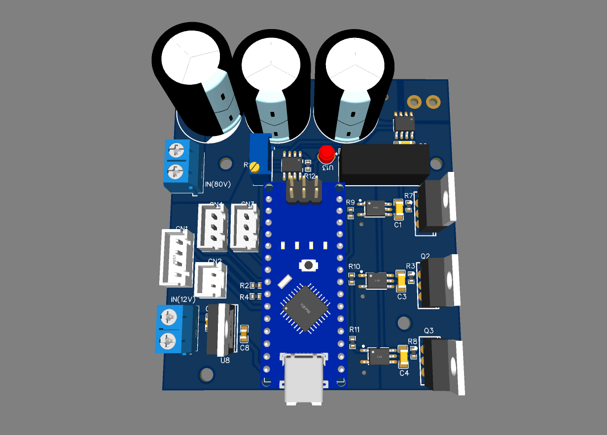
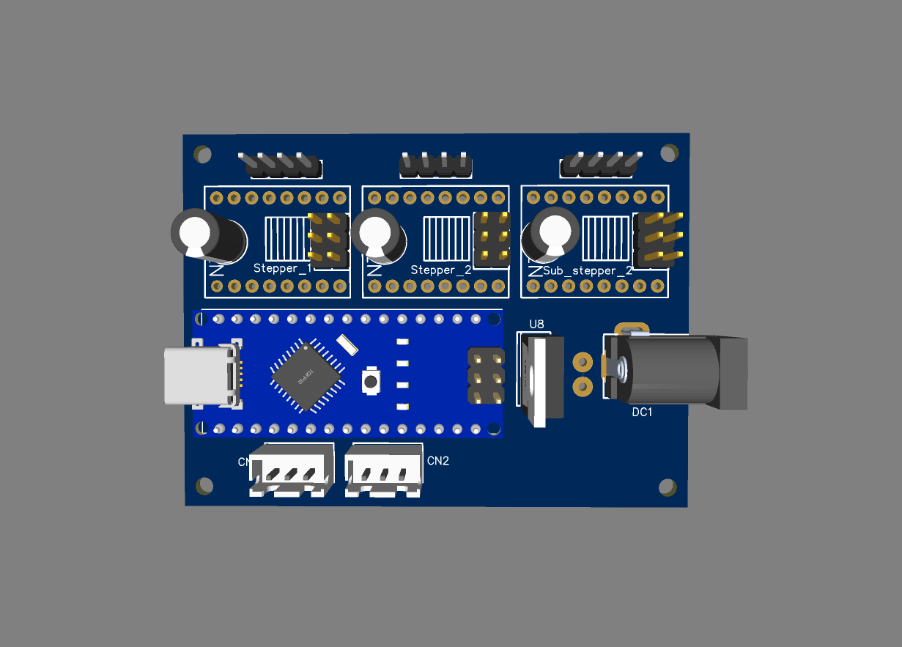
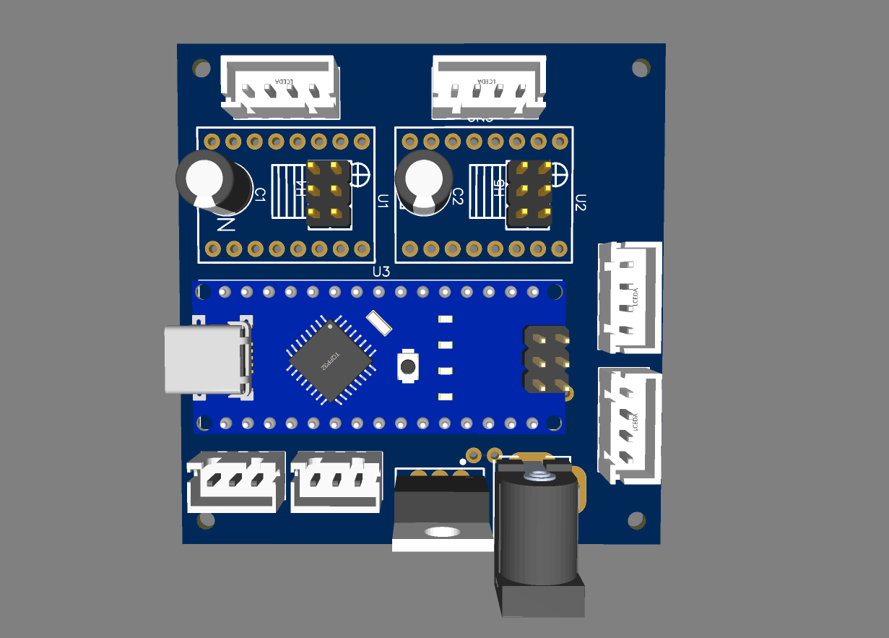

# Hardware 🔌🛠

В данном разделе представлены электрические схемы и печатные платы для аппаратных модулей электроэрозионного станка **Inofid-EDM-3.0**.

Все проекты выполнены в среде **EasyEDA**. Внутри каждой директории находятся файлы в формате `.json`, которые можно легко импортировать в EasyEDA (как Standard, так и Pro версии) для просмотра, редактирования или экспорта в Gerber-файлы для заказа плат.

---

## 📁 Структура раздела

Каждый модуль спроектирован на базе микроконтроллера **Arduino Nano** и выполняет свою изолированную задачу в системе станка:

* **Pulse_Generator** — схема генератора высокочастотных импульсов (искрогенератора). Отвечает за управление силовыми мосфетами и обработку обратной связи от датчика тока (компаратора).
  * 💾 **Прошивка:** [EDM_NEW](https://github.com/Inofid/Inofid-EDM-3.0/tree/main/Firmware/EDM_NEW)
* **Wire_supply** — схема системы автоматической подачи свежей и отвода отработанной проволоки. Управляет шаговыми двигателями катушек на основе положения рычагов.
  * 💾 **Прошивка:** [Wire_supply](https://github.com/Inofid/Inofid-EDM-3.0/tree/main/Firmware/Wire_supply)
* **Wire_tension** — схема системы контроля натяжения проволоки. Динамически подстраивает скорость шагового двигателя через PID-алгоритм для поддержания стабильного натяжения.
  * 💾 **Прошивка:** [Wire_Tension](https://github.com/Inofid/Inofid-EDM-3.0/tree/main/Firmware/Wire_Tension)

---

## 🖼 Галерея проектов

| Название проекта | Pulse_Generator | Wire_supply | Wire_tension |
| :--- | :---: | :---: | :---: |
| **Электрическая схема** |  |  |  |
| **Внешний вид платы** |  |  |  |

---

## 🚀 Как открыть файлы в EasyEDA

1. Откройте онлайн-редактор [EasyEDA](https://easyeda.com/editor) или запустите десктопное приложение.
2. В верхнем левом меню выберите: **Файл (File)** ➡️ **Открыть (Open)** ➡️ **EasyEDA...**
3. Загрузите соответствующий `.json` файл из папки интересующего вас модуля.
