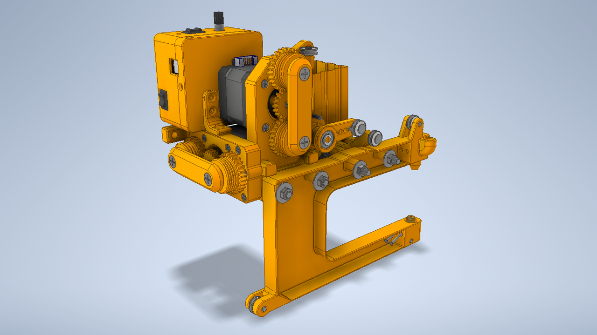
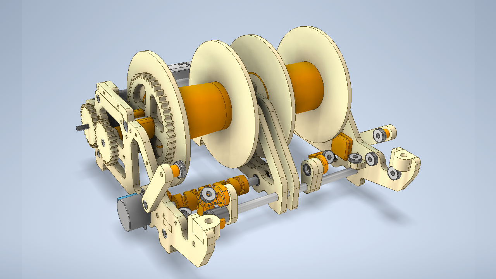
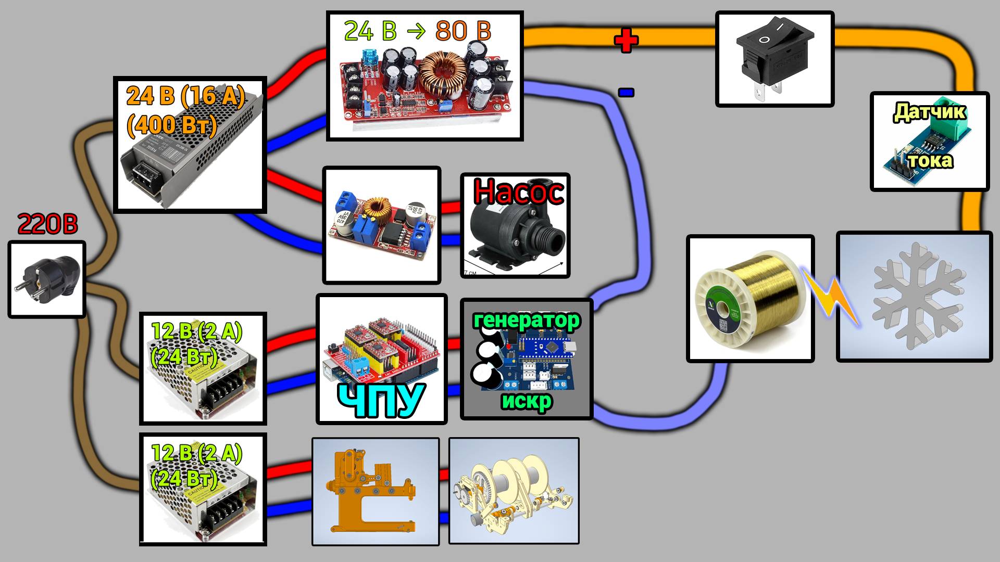

# ⚡ EDM-3.0 Компактная и бюджетная версия настольного электроэрозионного станка

> ### 🚧 Статус разработки (Work in Progress)
>
> Проект находится в стадии активной разработки и тестирования. 
> * **Обратите внимание:** файлы схем (schematics), CAD-моделей и прошивки (Firmware) могут регулярно обновляться.
> * В процессе оптимизации некоторые текущие файлы или проектные решения могут стать неактуальными и быть полностью заменены. Рекомендуется следить за обновлениями.

<table>
  <tr>
    <td></td>
    <td></td>
  </tr>  
</table>

## ⚙ Архитектура и состав проекта (Project Architecture)

Система разработана для быстрой интеграции в простой и доступный ЧПУ станок **CNC3018**. (Изготовление рамы станка не входит в проект)

Для модернизации станка к его рабочему столу крепится ёмкость с водой, а стандартный шпиндель заменяется на модуль натяжения проволоки. На модуле предусмотрен квадратный посадочный выступ 40×40 мм — он вставляется в штатное гнездо бесщеточного шпинделя диаметром 52 мм, вместо самого шпинделя.

### Проект состоит из трех основных независимых систем:

### 1. Система натяжения проволоки
Устанавливается на ось Z станка вместо стандартного шпинделя. Обеспечивает стабильное натяжение проволоки в зоне реза. Проволока поступает в этот модуль из (Системы 2)
* [**3D-модель**](CAD/Wire-tension)
* [**Электрическая схема**](Hardware/Wire_tension)
* [**Прошивка**](Firmware/Wire_Tension)

### 2. Система подачи и отвода проволоки
Располагается рядом со станком. Обеспечивает непрерывную размотку свежей проволоки и смотку отработанной. Проволока поступает в модуль натяжения (Система 1) через гибкие тефлоновые трубки.
* [**3D-модель**](CAD/Wire-supply)
* [**Электрическая схема**](Hardware/Wire_supply)
* [**Прошивка**](Firmware/Wire_supply)

### 3. Генератор импульсов для электроэрозии
Главный электронный блок, который формирует электрические разряды для эрозии металла.
* [**Электрическая схема**](Hardware/Pulse_Generator)
* [**Прошивка**](Firmware/EDM_NEW)

---

## ⚙️ Требования к электронике станка (Electronics Requirements)

Стандартные платы управления CNC3018 обычно оснащены встроенными драйверами шаговых двигателей **A4988**. Однако они **не подходят** для этого проекта.

### Драйверы шаговых двигателей (Stepper Drivers)

Для работы станка необходимо выставлять **микрошаг 1/128 или 1/256**. Стандартные A4988 этого не позволяют.

**Рекомендуемые драйверы:**

- **LV8729** — использовались автором проекта. Микрошаг 1/128 выставляется с помощью перемычек (jumpers).
- **TMC2209** — также подходят, но для микрошага выше 1/64 требуется другой интерфейс подключения (UART), что может быть затруднительно.

### Настройка прошивки (Firmware Settings)

После установки драйверов необходимо изменить следующие параметры в прошивке станка (GRBL):

| Параметр | Значение | Описание |
| :--- | :--- | :--- |
| `$100` / `$101` / `$102` | 6400 | Количество шагов на мм (steps/mm) для осей X/Y/Z |
| `$120` / `$121` | 3000 | Ускорение (acceleration), мм/с² |
| `$110` / `$111` | 100 | Максимальная скорость (max rate), мм/мин |

> - ⚠️ **Количество шагов на мм** зависит от конфигурации конкретного станка. Значение **6400** указано для микрошага 1/128. Пользователь должен перепроверить его самостоятельно.
> - **Ускорение 3000 мм/с²** может показаться высоким, но станок двигается очень медленно, поэтому проблем не возникнет. Такое ускорение необходимо для корректной работы системы поддержания искрового зазора.
> - **Максимальная скорость 100 мм/мин**. Быстрые перемещения с большим микрошагом могут привести к пропуску шагов или зависанию станка, поэтому максимальная скорость ограничена.
>   - Габариты станка небольшие, рабочая область ещё меньше, а холостых перемещений практически не будет: в большинстве случаев стартовое положение выставляется вручную.
>   - Рабочая скорость обычно ещё ниже — до **15 мм/мин**.

---

## 🔌 Требования к электропитанию (Power Requirements)
> [!WARNING]
> **ВЫСОКОЕ НАПРЯЖЕНИЕ!** Система питается от **сети 220 В**. А для работы генератора импульсов используется напряжение **80 В**, которое также представляет опасность. И всё это в непосредственной близости от воды.
> * Будьте предельно осторожны при сборке, отладке и эксплуатации устройства.
> * Автор проекта не несёт ответственности за любой ущерб здоровью или имуществу, полученный в ходе повторения данной конструкции. Все действия вы производите на свой собственный страх и риск.

##

### Для работы всей системы вам понадобятся следующие компоненты:
* **Блок питания 24 В (400 Вт)** — основной источник энергии.
* **Блок питания 12 В (2 А)** — 2 шт. (для раздельного питания логики и периферии).
* **Повышающий DC-DC модуль** — мощный преобразователь, который поднимает напряжение с 24 В до 80 В.

Полная карта межблочных соединений и полярности подключения представлена на схеме ниже:

---

## 💧 Система фильтрации и подачи воды (Fluid & Filtration System)

Для эффективного удаления продуктов эрозии (шлама) из зоны реза необходима постоянная циркуляция чистой воды. Система состоит из двух узлов:

* **Магистральный фильтр стандарта SL10 (или большего размера BB10/20)** — используется совместно с многоразовым промываемым картриджем тонкой очистки на **10 мкм**.
* **Центробежный водяной насос** — требуется насос достаточной мощности. Рекомендуется использовать именно **центробежный** насос, так как он выдаёт плавный поток воды без пульсаций. Поршневые или мембранные насосы создают вибрации, которые негативно влияют на стабильность искрового промежутка и точность реза.

---

## 📺 Видео на тему (YouTube):
<table>
  <tr>
    <td align="center"><b>Бюджетный настольный EDM. Часть 1</b></td>
    <td align="center"><b>Бюджетный настольный EDM. Часть 2</b></td>
    <td align="center"><b>Бюджетный настольный EDM. Часть 3</b></td>
  </tr>
  <tr>
    <td>
      
    </td>
    <td>
      
    </td>
    <td>
      
    </td>
  </tr>
</table>

---

## 📂 Структура репозитория

* [`CAD/`](/CAD) — Исходные файлы (CAD) 3D-моделей для работы в программе Autodesk Inventor.
* [`3D_Models/`](/3D_ModelsD) — STL и STEP файлы для 3D-печати и редактирования в других CAD-программах
* [`Hardware/`](/Hardware) — Исходные файлы электрических схем и плат в EasyEDA
* [`Firmware/`](/Firmware) — Исходный код прошивок (Arduino Code) для микроконтроллеров.
* [`LICENSE`](LICENSE) / [`LICENSE-HARDWARE.md`](LICENSE-HARDWARE.md) — Юридические документы, регламентирующие использование материалов.

---

## ⚖️ Лицензирование (Licensing)

Проект использует двойную схему лицензирования:

* **Программное обеспечение (ПО):** Исходный код прошивки распространяется под лицензией **[MIT License](LICENSE)**.
* **Аппаратное обеспечение (Hardware, CAD):** Все схемы, чертежи, платы и 3D-модели распространяются под лицензией **[Creative Commons Attribution 4.0 International (CC BY 4.0)](LICENSE-HARDWARE.md)**. Вы можете свободно использовать и модифицировать их при условии указания авторства.
